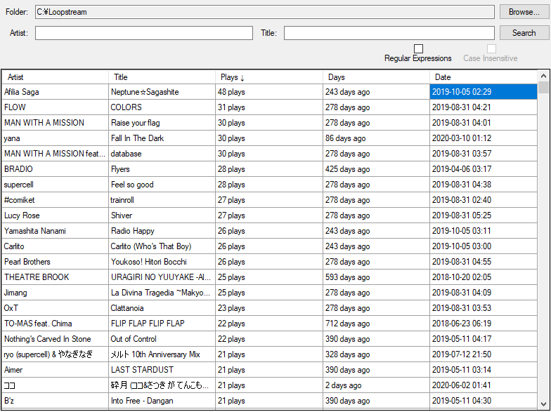

# Loopstream Last Played
Adding to the list of useless things only I wanted.

Goes through [Loopstream](https://github.com/9001/Loopstream) logs in a given directory and lists every song played, how many times it's been played, and the last time it was played. Allows searching via artist or title, optionally using regex. Each field is sortable as well.

